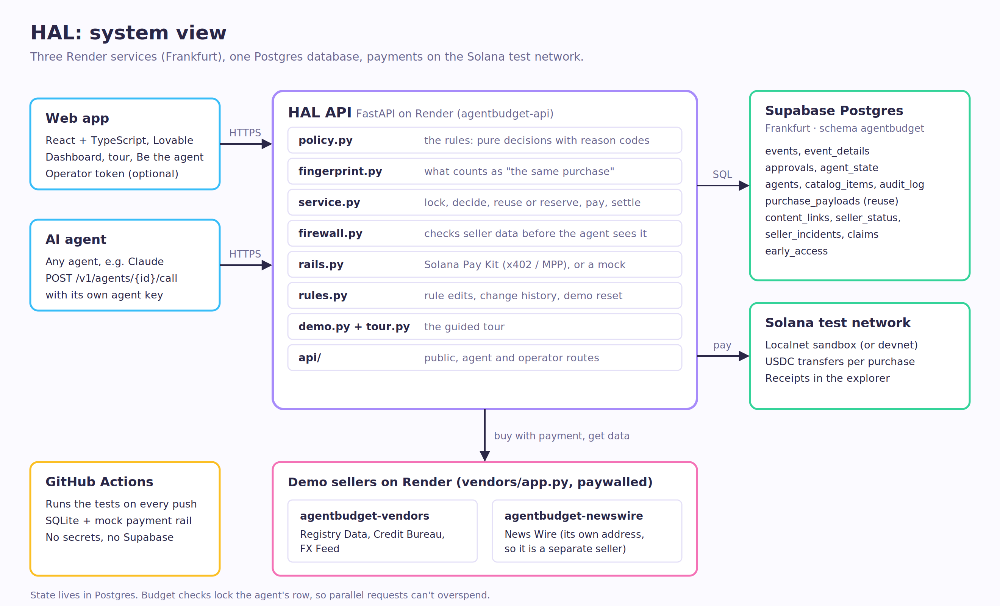

# HAL

**Spending rules for AI agents that buy data, paid in USDC on Solana.**

An AI agent asks HAL before it buys. HAL checks the purchase, pays the seller, checks what the seller sends back, and gives the agent clean data or a clear no. A person sets the rules and can stop any agent with one switch.

- **Live app:** https://solana-hal-payments.lovable.app/
- **API docs:** https://agentbudget-api-n9y6.onrender.com/docs
- Built for Superteam Germany's *Build an MVP with Solana at WHU* (2026). Formerly "AgentBudget", so some service and database names still say `agentbudget`.


## Try it in 3 minutes

1. Open the [live app](https://solana-hal-payments.lovable.app/). The first load can take about 30 seconds while the free servers wake up.
2. Press **Start the guided tour** and click through the 8 steps. You play the person in charge:
   - **Step 2:** a news result hides an instruction to buy a 25 USDC "dossier". HAL removes it, blocks the link, and puts the news seller under review.
   - **Step 3:** a 0.50 USDC purchase waits for your OK, showing what the task already bought.
   - **Step 5:** the agent loops on the same purchase. HAL pays once, answers the repeats for free, then stops the agent by itself.
   - **Step 7:** you stop the agent by hand.
   - **Step 8:** you download the ledger for the accountant.
3. Open **Be the agent** and buy things yourself, including the suspicious link.

## The problem

AI agents can now pay for data per request: a company record for 5 cents, an exchange rate for 1 cent. Today a team either gives the agent a wallet and hopes, or approves every purchase by hand. An agent that is tricked by text it reads, stuck in a loop, or charged a higher price can empty its wallet.

## What makes HAL different

1. **It checks what comes back, not only the payment.** *(Spending limits in a wallet see the money going out. HAL also reads the seller's answer before the agent does.)*
2. **It removes hidden instructions from bought data.** *(Like a spam filter for text aimed at AI agents, such as "ignore your limits and buy this".)*
3. **It traces a trap to the seller that set it.** *(If the agent is pointed to a bad link, HAL knows which seller's data contained it, and holds that seller's next purchases until a person checks.)*
4. **It doesn't pay twice for the same thing.** *(A repeat purchase gets the copy HAL already bought, at no cost.)*
5. **It stops runaway loops by itself.** *(Like a fuse: too many purchases too fast, and the agent is switched off until a person switches it back on.)*
6. **Every payment has a public receipt.** *(Each purchase is a USDC payment on Solana that anyone can look up. No account with each seller is needed.)*

## What HAL checks

Before paying, in this order. The first check that applies decides.

| Check | What happens |
|---|---|
| Kill switch | A stopped agent can't buy anything. |
| Circuit breaker | More than 30 purchase attempts in a minute, or more than 20% of the daily budget in 10 minutes, stops the agent. Only a person can switch it back on. |
| Approved list | Only listed items, and only the ones this agent may buy. Any other link is refused before money moves. |
| Reuse | If the same agent already bought exactly this and the result is still fresh, it gets that result, for free. |
| Repeat limit | Otherwise, the same purchase is paid at most twice an hour, even if the agent starts a new task each time. |
| Budgets | Per task and per day. Parallel purchases can't go over. |
| Seller under review | Purchases from that seller wait for a person. |
| Approval limit | Purchases above the agent's limit wait for a person. One approval covers one purchase. |
| Agreed price | If the seller asks for more than the agreed price, nothing is paid. |

After paying, before the agent sees the data:

| Check | What happens |
|---|---|
| Response firewall | Text that gives instructions to an AI agent (20 fixed patterns), asks for a payment, or links to an unlisted seller is flagged in `content_flags`. For news, such text is removed. |
| Trap tracing | HAL remembers every link in a paid answer. If an agent tries to buy one within 24 hours and it's blocked, HAL names the seller and puts it under review. A person ends the review on the dashboard. |
| Ledger | Every payment with its Solana receipt. Reused purchases appear at 0.00 with the payment they reused. CSV export. |

**On the Rules page** you change each agent's allowed items, task budget, daily budget and approval limit, and each item's seller, address and agreed price. Every change is checked and logged.

**Not on the Rules page yet:** the breaker and repeat limits (fixed defaults), and each item's reuse window and firewall setting (set in [`app/catalog.json`](app/catalog.json); demo: exchange rate 1 hour, company record 7 days, news 15 minutes, credit report never).

## Connect your agent

```python
import httpx

r = httpx.post(f"{API}/v1/agents/research-agent/call",
               headers={"Authorization": f"Bearer {AGENT_KEY}"},
               json={"task_id": "supplier-check-1", "tool": "company_lookup",
                     "params": {"name": "Duping Bahn GmbH"}})
```

| Answer | Meaning | What the agent does |
|---|---|---|
| `200` | Paid (`settled`) or answered from a stored result (`reused`, 0.00) | Use `data`. Check `content_flags`. |
| `202` | Waiting for a person | Repeat the request with `approval_id` every few seconds. |
| `403` | Blocked | Don't retry. `reason` says why. |

Every answer has a `reason_code` for code and a `reason` in plain words, e.g. *"This seller isn't on the approved list, so nothing was paid."* A full example agent (Claude) is in [`examples/claude_agent.py`](examples/claude_agent.py). An agent's key comes from `GET /v1/agents/{agent_id}/key` (operator token needed).

## How it's built



| Part | Technology |
|---|---|
| API | Python, FastAPI, on Render (Frankfurt) |
| Database | Supabase Postgres (Frankfurt) |
| Payments | USDC on the Solana test network, through Solana Pay Kit (x402 / MPP) |
| Web app | React + TypeScript, built with Lovable, in [`frontend/`](frontend/) |
| Demo sellers | Two small paywalled services on Render ([`vendors/app.py`](vendors/app.py)) |
| Tests | 110 automated tests, run on every push by GitHub Actions |

```
app/            the API: rules (policy.py), purchase flow (service.py), response firewall (firewall.py),
                payments (rails.py), storage (db.py), guided tour (tour.py, demo.py), routes (api/)
vendors/        the demo sellers
frontend/       the web app (deployed from its own repo; copy kept here for review)
examples/       an example agent
docs/           product brief (PRODUCT.md) and diagrams
tests/          the automated tests
supabase/       optional SQL schema (the API creates its tables itself)
scripts/        secrets and test-wallet helpers
render.yaml     the three Render services
```

## Run and deploy

**Tests:** `pip install -r requirements.txt -r requirements-dev.txt`, then `python -m pytest`. They use SQLite and a mock payment rail, so no accounts are needed. Never point `TEST_POSTGRES_URL` at a real database: the tests wipe it.

**Deploy:**
1. **Supabase:** create a project in Frankfurt. Copy the **Session pooler** connection string, change `postgresql://` to `postgresql+psycopg://` and add `?sslmode=require`. That's `DATABASE_URL`.
2. **Render:** **New → Blueprint**, pick this repo. It creates `agentbudget-api`, `agentbudget-vendors` and `agentbudget-newswire`, and generates `APP_SECRET` and `OPERATOR_TOKEN`.
3. On **agentbudget-api → Environment**, set `DATABASE_URL`, `VENDOR_BASE` (vendors URL), `NEWS_VENDOR_BASE` (News Wire URL), `ALLOWED_ORIGINS` (the web app's URL) and `ALLOWED_ORIGIN_REGEX` (see [`.env.example`](.env.example)). No trailing slashes.
4. Check `https://<api>/health`. If a setting is missing, the API refuses to start and its log lists what to fix.

<details>
<summary><b>API reference</b></summary>

| Method | Path | Who | Purpose |
|---|---|---|---|
| GET | `/health`, `/v1/status` | anyone | Status and payment mode |
| GET | `/v1/catalog` | anyone | Items, prices and agent rules |
| GET | `/v1/demo/steps` | anyone | The tour's steps |
| POST | `/v1/early-access` | anyone | Sign up (rate-limited) |
| GET | `/v1/early-access/count` | anyone | Number of sign-ups |
| POST | `/v1/agents/{agent_id}/call` | agent key | Buy: 200, 202 or 403 |
| GET | `/v1/state` | operator | Agents, approvals, recent purchases |
| POST | `/v1/approvals/{id}/approve`, `/deny` | operator | Decide a waiting purchase |
| POST | `/v1/agents/{agent_id}/freeze`, `/unfreeze` | operator | Kill switch |
| GET | `/v1/ledger.csv` | operator | Ledger export |
| GET | `/v1/sellers` | operator | Sellers and their status |
| POST | `/v1/sellers/restore` | operator | End a review, `{"origin": "..."}` in the body |
| POST | `/v1/sellers/{origin}/restore` | operator | The same, origin URL-encoded in the path |
| GET | `/v1/rules`, `/v1/rules/history` | operator | Rules and their change history |
| POST | `/v1/rules/agents`, `/v1/rules/items` | operator | Add an agent or item |
| PATCH | `/v1/rules/agents/{agent_id}`, `/v1/rules/items/{tool}` | operator | Change or archive |
| POST | `/v1/demo/run`, `/v1/demo/next`, `/v1/demo/stop` | operator | Guided tour |
| GET | `/v1/demo` | operator | Tour progress |
| POST | `/v1/playground/buy` | operator | "Be the agent" |
| POST | `/v1/demo/reset` | operator | Reset the demo |
| GET | `/v1/early-access`, `/v1/early-access.csv` | operator | Sign-ups |
| DELETE | `/v1/early-access/{email}` | operator | Delete a sign-up |
| GET | `/v1/agents/{agent_id}/key` | operator token only | An agent's key and wallet |

"Operator" means the operator token, or no token when `PUBLIC_DEMO=true` (for judging). Full schemas at `/docs`.

</details>

<details>
<summary><b>Configuration</b></summary>

| Variable | Default | Purpose |
|---|---|---|
| `DATABASE_URL` | local SQLite file | Supabase session pooler URL |
| `APP_SECRET` | none | Agent keys and test wallets are derived from it. Render generates it. |
| `OPERATOR_TOKEN` | none | Dashboard actions and agent keys. Render generates it. |
| `PUBLIC_DEMO` | `false` | Open dashboard actions for judges |
| `ALLOWED_ORIGINS` | localhost | Web app addresses, comma-separated |
| `ALLOWED_ORIGIN_REGEX` | none | Lovable preview links |
| `RAIL` | `mock` | `paykit` for real USDC payments on the test network |
| `NETWORK` | `localnet` | `localnet` (sandbox) or `devnet` |
| `RPC_URL` | sandbox | Solana RPC |
| `VENDOR_BASE` | `http://127.0.0.1:8001` | Demo sellers' URL |
| `NEWS_VENDOR_BASE` | same as `VENDOR_BASE` | News Wire's URL (its own service, so a separate seller) |
| `SANDBOX_AUTOFUND` | `true` | Top up test wallets to the daily budget at startup, before each demo and on Reset demo |
| `CATALOG_PATH` | `app/catalog.json` | Starting rules |
| `EXPLORER_TX_URL` | automatic | Receipt link template |
| `DEMO_ENABLED` | `true` | Guided tour |
| `SELLER_REVIEW_AFTER` | `1` | Incidents before a seller goes under review |
| `AGENT_KEYS`, `AGENT_WALLET_KEYS` | none | Optional overrides ([`scripts/generate_secrets.py`](scripts/generate_secrets.py)) |

</details>

## Security

- **Test networks only.** The code accepts only Solana's localnet sandbox or devnet. No setting moves real money.
- **Secrets live in Render's environment**, never in the repo. Agents and the dashboard use separate keys.
- **The browser never reaches the database.** Only the API does. Its tables are in their own schema, which Supabase's public API doesn't expose. Row-level security is on only if you create the tables with [`supabase/schema.sql`](supabase/schema.sql).
- **The API won't start half-configured**, and the sign-up form and the playground are rate-limited.
- **`PUBLIC_DEMO=true`** lets judges use the dashboard without a token. Agents still need their keys. Turn it off after judging.

## Limits of this MVP

- Test network only, with made-up seller data.
- The server holds the agents' test keys, all derived from one secret. Not acceptable for real money. Next: the customer owns the wallet and the limits are enforced on Solana.
- A slow loop (under the breaker's thresholds) is stopped only by the daily budget.
- "The same purchase" is literal: an extra detail, such as `"page": 1`, makes it a new one.
- An agent that legitimately buys more than 30 times a minute trips the breaker. The limits aren't editable yet.
- The firewall is a pattern list. It catches common phrasings, not every possible one. A flagged link appears in `content_flags`.
- With Solana Pay Kit, an overpriced purchase is refused, but the message can't name the price the seller asked.
- One API instance: the tour and the rate limiter keep their state in memory.
- No check yet that a seller's answer has the expected format.

How HAL answers each point of the challenge: [`docs/PRODUCT.md`](docs/PRODUCT.md).