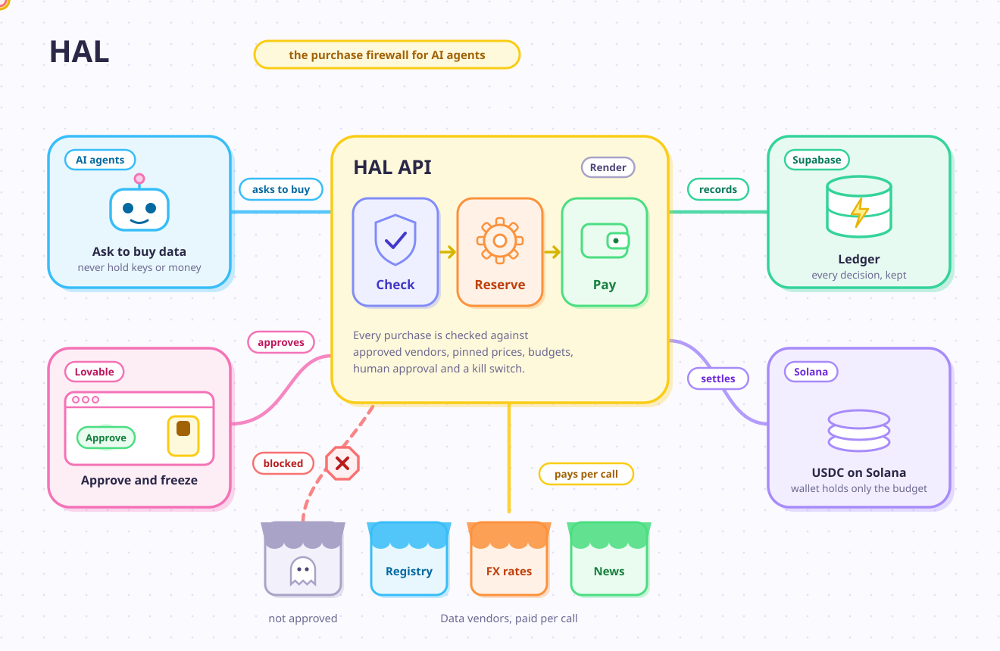
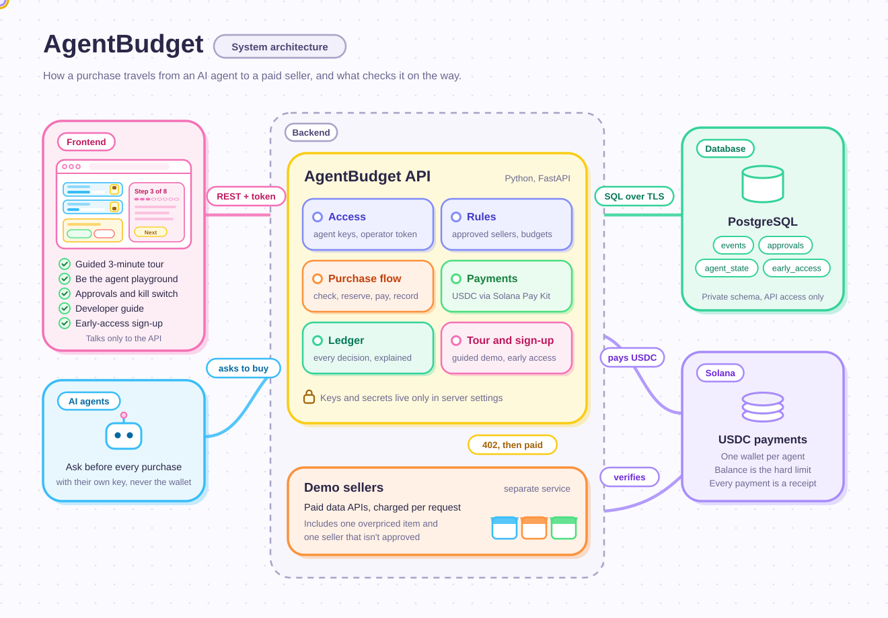

# HAL

*Formerly AgentBudget. Some technical names (Render services, database schema) still use `agentbudget`.*

**Let AI agents buy what they need. Within your rules.**

HAL is a spending account for AI agents:
- Small purchases go through on their own.
- Big ones wait for a person.
- Purchases from unknown sellers are blocked.
- One switch stops everything.
- Every payment is made in USDC on Solana and has a receipt anyone can check.

### ▶ Try it live: **[https://solana-hal-payments.lovable.app/](https://solana-hal-payments.lovable.app/)**

Built for Superteam Germany's *Build an MVP with Solana at WHU* (2026). This repo is the **backend** (FastAPI on Render, Supabase Postgres).



*Both diagrams are animated on GitHub. For slides use the GIFs ([overview](docs/architecture.gif), [system](docs/architecture-technical.gif)) or the PNGs. The system view is under [Architecture details](#architecture-details).*

## For judges: 3 minutes

1. Open the live app: **[https://solana-hal-payments.lovable.app/](https://solana-hal-payments.lovable.app/)** (the first load can take about 30 seconds while the server wakes up). Opening the app also wakes the demo seller services.
2. Press **Take the 3-minute tour**. You're the person in charge. Press **Run step** to move on.
   - At step 2 HAL traces a hidden trap to the seller that sent it, and puts that seller under review.
   - At step 3 you approve a purchase. The request shows what the task already bought.
   - At step 5 a looping agent is paid for once, gets the stored result after that, and is stopped automatically. You switch it back on.
   - At step 7 you flip the kill switch by hand.
3. Then open **Be the agent** and try buying things yourself, including the suspicious link.

How we answer each point of the listing: [`docs/PRODUCT.md`](docs/PRODUCT.md).

## The problem in one paragraph

Agents can now pay for data per request: a company record for 5 cents, an exchange rate for 1 cent. Teams give their agent a wallet and hope. If the agent gets tricked by text it reads, gets stuck in a loop, or a seller raises the price, the wallet empties. The only alternative today is approving every purchase by hand. HAL sits between the agent and its money and applies the rules a person set.

## What it controls

| Control | What happens |
|---|---|
| Approved sellers | Only sellers on the list can be paid. Links from text the agent read are refused before money moves. |
| Agreed prices | Each item has an agreed price. If a seller asks for more, the payment isn't signed. |
| Budgets | Per task and per day. Even many purchases at the same moment can't go over. |
| Your OK above a limit | Purchases above an agent's limit wait for a person. Each approval works once, for one purchase. |
| Kill switch | Stops one agent's spending, starting with its next purchase. |
| Repeat purchases | The same purchase (same item, same details) is paid at most twice per hour, across all tasks. A loop that starts a new task every time is still caught. |
| Purchase reuse | If the same purchase was already paid and its result is still fresh, HAL sends the stored result and pays nothing. Each item has its own window, set in `catalog.json` (in the demo: exchange rate 1 hour, company record 7 days, news 15 minutes, credit report never). Reuse is checked before the repeat rule, and reused purchases don't use any budget. Stored results are kept only for items with reuse, up to 256 KB, and deleted when the window ends. |
| Circuit breaker | More than 30 attempts in a minute, or more than 20% of the daily budget spent in 10 minutes, freezes the agent automatically. Only a person can switch it back on. |
| Response firewall | HAL checks the data each seller sends back before the agent sees it. Text that gives instructions to an AI agent, asks for a payment, or links to an unapproved seller is flagged. For items set to `redact` (in the demo: news), instructions and payment requests are removed. |
| Source of a trap | HAL remembers every link in a paid response. If an agent later tries to buy one of those links and it is blocked, HAL names the seller that sent it and puts that seller under review: its next purchases wait for a person. An operator can end the review. |
| Allowed items per agent | Each agent can only buy what it was allowed to buy. |
| Receipts | Every paid purchase is in the ledger with its Solana receipt, and exports as a CSV for the accountant. |

All of these are set per agent and per item on the dashboard's **Rules** page. Changes are checked (a task budget can't exceed the daily budget, prices must be above zero, ...), apply to the very next purchase, and are written to a change history. Agents and items are archived, never deleted, so the ledger keeps its meaning.

Every answer comes with a `reason_code` for software and a `reason` in plain words, e.g. *"This seller isn't on the approved list, so nothing was paid."*

## Using it with your own agent

1. **Add your agent** on the Rules page: what it may buy, its task and daily budgets, and above which amount it needs your OK. It gets its own key and wallet automatically (`GET /v1/agents/{agent_id}/key`).
2. **Add the sellers** your agent buys from: their address and the price you agreed to. Any service that takes payment per request on Solana works.
3. **Fill the wallet.** On the test network this happens automatically. With real money it would be USDC sent to the agent's wallet address.
4. **Change one line in your agent:** ask HAL instead of calling the seller directly (below).
5. **Watch the dashboard:** approve big purchases, flip the kill switch, download the ledger.

## Connect your agent

```python
import httpx

r = httpx.post(f"{API}/v1/agents/research-agent/call",
               headers={"Authorization": f"Bearer {AGENT_KEY}"},
               json={"task_id": "supplier-check-1", "tool": "company_lookup",
                     "params": {"name": "Duping Bahn GmbH"}})
```

| Answer | Meaning | What your agent does |
|---|---|---|
| `200` | Paid | Use `data`. The receipt is in `tx`. `content_flags` lists anything HAL found in the data, e.g. instructions aimed at agents. |
| `202` | Waiting for a person | Repeat the same request with `approval_id` every few seconds. |
| `403` | Blocked | Don't retry. `reason` says why. |

A complete example agent (Claude) is in [`examples/claude_agent.py`](examples/claude_agent.py).

## Repo layout

```
app/
  main.py         app setup: config checks, CORS, security headers, routers
  settings.py     every setting from environment variables; refuses to start if something is missing
  security.py     agent keys and the operator token
  policy.py       the rules: pure decision logic with reason codes and plain messages
  service.py      the purchase flow: lock, decide, reserve, pay, settle or release
  db.py           storage: Supabase Postgres (SQLite only for the automated tests)
  rails.py        Solana payments through Solana Pay Kit (plus a mock for tests)
  tour.py         the guided tour's steps, in plain words (one place for all tour text)
  demo.py         runs the tour (visitor-driven) or the full demo (automatic)
  ratelimit.py    limits for public endpoints
  sandbox.py      tops up agent wallets on the Solana test network
  rules.py        rules editing: validation, change history, demo reset
  catalog.json    the starting rules: fills an empty database, and Reset demo restores them
  api/            public.py, agent.py, operator.py
vendors/app.py    demo sellers: paid APIs behind a Solana paywall (its own service)
scripts/          generate_secrets.py (optional key overrides), fund_sandbox.py
examples/         claude_agent.py
supabase/         schema.sql (optional; the API creates its tables itself)
docs/             product brief, pitch, plan, diagrams
tests/            rules, API, tour, playground, early access; run on SQLite and Postgres
render.yaml       Render Blueprint for both services
```

## Deploy and test on Render

Everything runs on Render. New work goes on a branch: point both services at that branch, test, merge into `main`, then point them back at `main`.

**1. Supabase (database)**
1. Create a project in region *Central EU (Frankfurt)*.
2. Click **Connect** and copy the **Session pooler** connection string.
3. Turn it into `DATABASE_URL`: replace `postgresql://` with `postgresql+psycopg://` and add `?sslmode=require`.

The API creates its tables on first start. Nothing else to set up.

**2. Render (API and demo sellers)**
1. Render → **New → Blueprint**, then pick the repo. It creates `agentbudget-api`, `agentbudget-vendors` and `agentbudget-newswire`, and generates `APP_SECRET` and `OPERATOR_TOKEN` by itself.
2. Open **agentbudget-api → Environment** and set:
   - `DATABASE_URL`
   - `VENDOR_BASE`: the vendors service's URL
   - `NEWS_VENDOR_BASE`: the News Wire service's URL (News Wire runs on its own service, so it counts as a separate seller)
   - `ALLOWED_ORIGINS`: the frontend's URL, `https://solana-hal-payments.lovable.app`
   - `ALLOWED_ORIGIN_REGEX`: value in [`.env.example`](.env.example)
3. Redeploy. Then check `https://<api>/health` and `https://<api>/docs`.

If something is missing, the API doesn't start, and its log lists every missing setting with the fix.

**3. Frontend**

The web app is live at **[https://solana-hal-payments.lovable.app/](https://solana-hal-payments.lovable.app/)** and talks only to this API.

**Branch testing notes**
- Switching a branch keeps the environment variables. Both branches use the same database, so don't run two branches at the same time against it.
- The automated tests run with `python -m pytest` (SQLite and a mock payment rail, no Render needed). Never point `TEST_POSTGRES_URL` at Supabase: the tests wipe their schema.

## API

| Method | Path | Who | Purpose |
|---|---|---|---|
| GET | `/v1/status` | anyone | Status, payment mode, whether a token is needed (used by the web app) |
| GET | `/health` | anyone | Same as `/v1/status`, for Render's health check (some ad blockers block this address) |
| GET | `/v1/catalog` | anyone | What agents can buy, agreed prices, agent rules |
| GET | `/v1/demo/steps` | anyone | The guided tour's steps in plain words |
| POST | `/v1/early-access` | anyone | Sign up for early access (rate-limited, spam trap) |
| GET | `/v1/early-access/count` | anyone | Number of sign-ups |
| POST | `/v1/agents/{agent_id}/call` | agent key | Buy something: 200 paid, 202 waiting, 403 blocked |
| GET | `/v1/state` | operator | Agents, purchases waiting for approval, recent purchases |
| POST | `/v1/approvals/{id}/approve`, `/deny` | operator | Decide a waiting purchase |
| POST | `/v1/agents/{agent_id}/freeze`, `/unfreeze` | operator | Kill switch |
| GET | `/v1/ledger.csv` | operator | Export for the accountant |
| POST | `/v1/demo/run?mode=tour\|auto` | operator | Start the guided tour or the automatic demo |
| POST | `/v1/demo/next`, `/v1/demo/stop` | operator | Run the next tour step, or end the tour |
| GET | `/v1/demo` | operator | Where the tour is and what it's waiting for |
| POST | `/v1/playground/buy` | operator | "Be the agent": try a purchase as a demo agent |
| POST | `/v1/demo/reset` | operator | Demo only: clear purchases, restore the starting rules, release kill switches, refill test wallets |
| GET | `/v1/rules` | operator | All agents and items, including archived ones |
| POST | `/v1/rules/agents`, `/v1/rules/items` | operator | Add an agent or an item |
| PATCH | `/v1/rules/agents/{agent_id}`, `/v1/rules/items/{tool}` | operator | Change rules, or archive with `{"active": false}` |
| GET | `/v1/rules/history` | operator | Who changed which rule, when, from what to what |
| GET | `/v1/sellers` | operator | Every seller with its status (`active` or `under_review`) and number of incidents |
| POST | `/v1/sellers/{origin}/restore` | operator | End a review. Recorded in the change history. |
| GET | `/v1/early-access`, `/v1/early-access.csv` | operator | Sign-ups |
| GET | `/v1/agents/{agent_id}/key` | operator token only | An agent's key and wallet address, to connect a real agent |
| DELETE | `/v1/early-access/{email}` | operator | Delete a sign-up on request |

"Operator" means the operator token, or no token when `PUBLIC_DEMO=true` (for judging). Revealing agent keys always needs the real token. Full schemas at `/docs`.

## Security

- **Test networks only.** The code accepts only Solana's localnet sandbox or devnet. No setting can make it move real money.
- **Two kinds of keys.** Agents spend only as themselves, with keys derived from `APP_SECRET`. The dashboard uses a separate operator token.
- **Secrets only in Render's environment.** Render generates `APP_SECRET` and `OPERATOR_TOKEN`. Nothing secret is in the repo.
- **The browser never touches the database.** Tables live in a private schema that Supabase's public API doesn't expose, with row-level security on.
- **The API won't start half-configured.** Missing keys, a missing seller address or an open CORS setting stop it, with a clear list in the log.
- **Public endpoints are rate-limited.** The sign-up form has a spam trap and gives the same answer whether or not an email is already on the list.
- **`PUBLIC_DEMO=true`** lets judges approve and freeze without a token. Agents still need their keys. Turn it off after judging.

## Architecture details



The API keeps no state of its own; everything lives in Postgres. Budget decisions lock one agent's row while they check and reserve the money, so several API instances can never spend the same budget twice. The guided tour and the rate limiter keep their state in memory, so they assume one instance (fine on Render's free plan).

## Configuration

| Variable | Default | Purpose |
|---|---|---|
| `DATABASE_URL` | SQLite file (tests only) | Supabase session pooler URL |
| `APP_SECRET` | none | One random string; each agent's key and test wallet are derived from it. Render generates it. |
| `OPERATOR_TOKEN` | none | Dashboard actions, and revealing agent keys. Render generates it. |
| `PUBLIC_DEMO` | `false` | Open dashboard actions for judges |
| `ALLOWED_ORIGINS` | localhost | Comma-separated web app addresses |
| `ALLOWED_ORIGIN_REGEX` | none | Lovable preview links: `https://([a-z0-9-]+\.)*(lovable\.app\|lovableproject\.com)` |
| `RAIL` | `mock` | `paykit` for real USDC payments on the test network |
| `NETWORK` | `localnet` | `localnet` (Solana sandbox) or `devnet` |
| `RPC_URL` | sandbox | Solana RPC |
| `VENDOR_BASE` | `http://127.0.0.1:8001` | The demo sellers' public URL |
| `NEWS_VENDOR_BASE` | same as `VENDOR_BASE` | News Wire's public URL. Its own service makes it a separate seller. |
| `SANDBOX_AUTOFUND` | `true` | Top up agent wallets on the sandbox at startup and before each demo |
| `CATALOG_PATH` | `app/catalog.json` | The starting rules (the live rules are in the database) |
| `EXPLORER_TX_URL` | automatic | Receipt link template with `{tx}` |
| `DEMO_ENABLED` | `true` | The guided tour and demo |
| `SELLER_REVIEW_AFTER` | `1` | Incidents before a seller goes under review |
| `AGENT_KEYS`, `AGENT_WALLET_KEYS` | none | Optional overrides per agent (`scripts/generate_secrets.py`) |

## Honest limitations

- Runs on Solana's test networks only, never with real money.
- The server holds the agents' test keys. Next version: the customer owns the wallet and the limits are enforced on Solana.
- Seller data is made up.